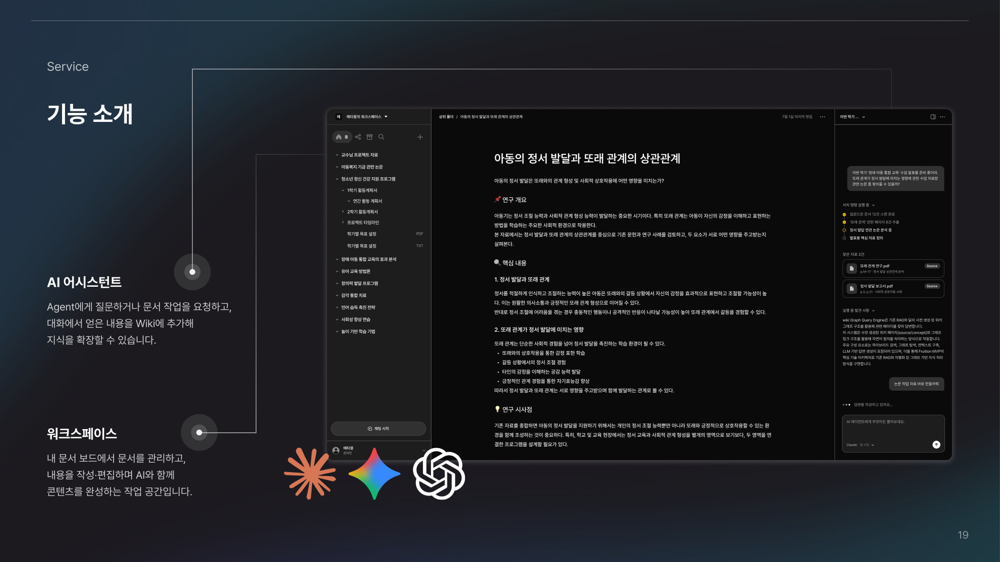
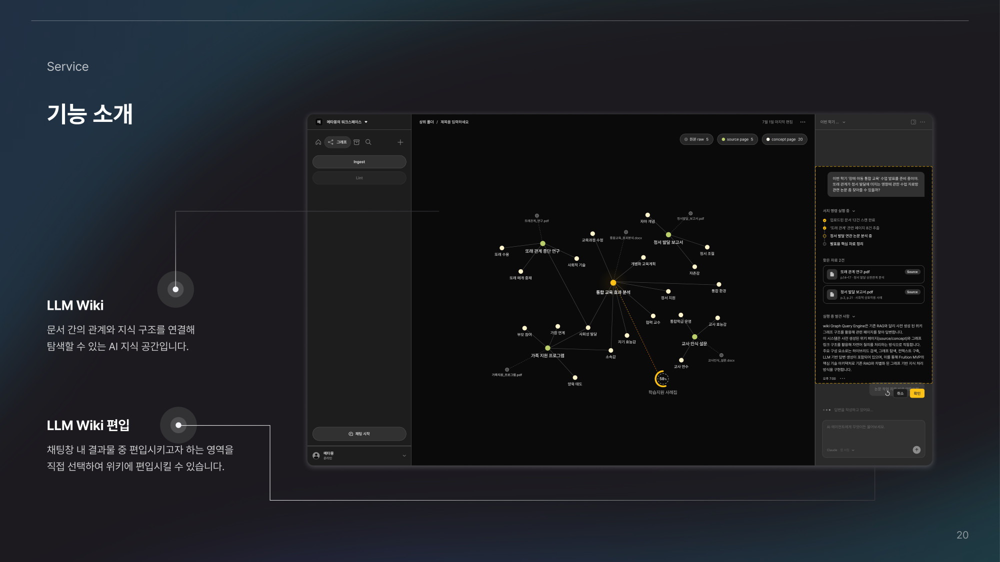
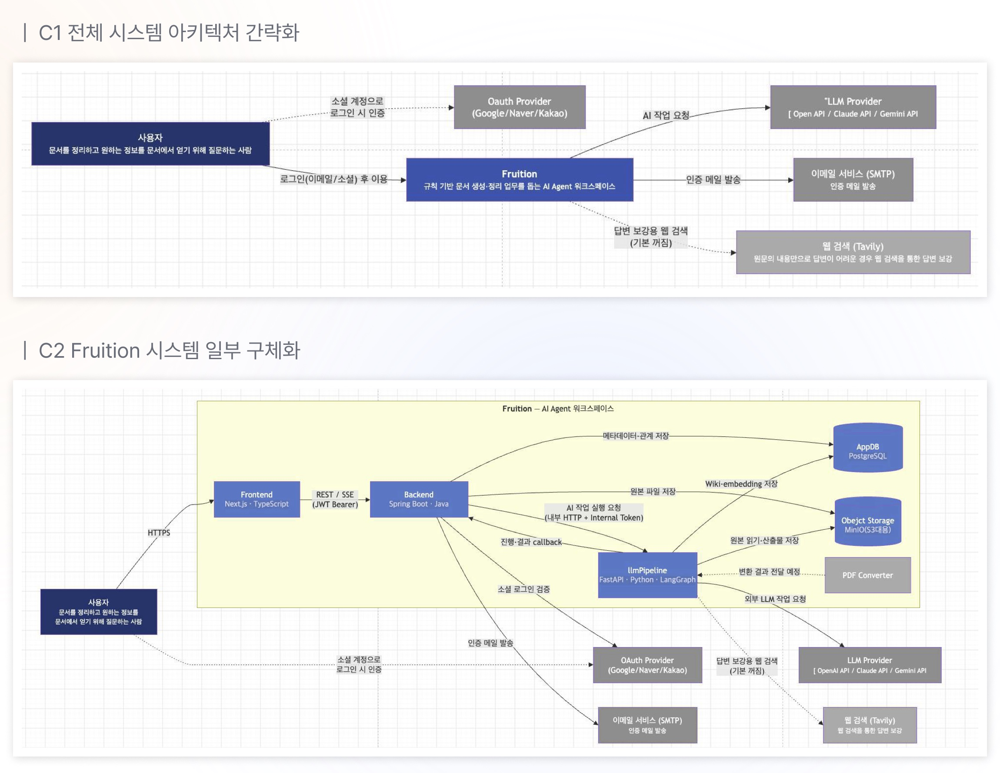
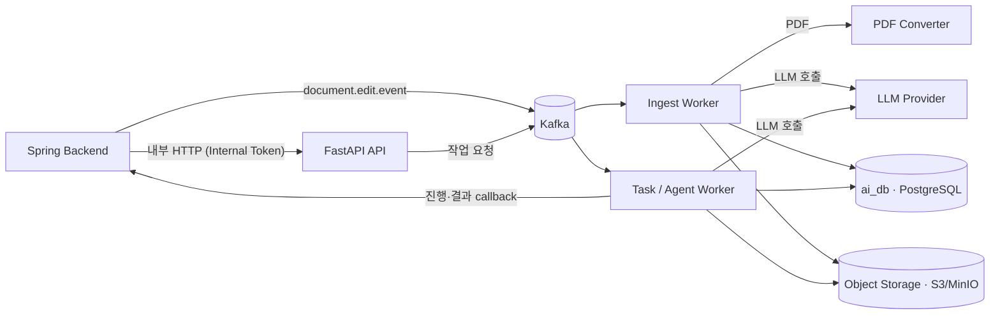

# Fruition AI

> 흩어진 문서를 근거 있는 지식으로. 업로드한 문서를 LLM Wiki로 정리하고, 원문 근거로 답변하며, 자연어로 문서를 편집하는 AI 워크스페이스 **Fruition**의 AI 서버입니다.

AI SW 마에스트로 17기 · 2026.04 — 현재 · [전체 서비스 구조(platform)](https://github.com/FruitionKR/Fruition-flatform/blob/main/docs/README.md)

## 1. Problem

문서는 계속 쌓이지만, 저장만 해 두고 정작 필요할 때 찾지 못합니다. 팀원이 겪던 이 불편을 디자인 싱킹으로 구체화했습니다.

- 키워드 검색은 표현이 다르면 필요한 문서를 놓칩니다.
- 일반 RAG는 질문할 때마다 원문 조각을 다시 찾아, 문서 사이의 관계와 누적된 지식이 남지 않습니다.
- 논문 같은 PDF는 변환 과정에서 표·수식이 깨져 근거로 쓰기 어렵습니다.

## 2. Solution

문서를 올리면 AI가 **Source·Concept 페이지로 이루어진 Wiki**로 정리하고, 이후 질문과 편집은 이 Wiki와 원문 근거를 기반으로 동작합니다.

| 기능 | 설명 |
|---|---|
| **Ingest** | PDF를 Markdown으로 복원하고, 문서별 Source 페이지와 공통 Concept 페이지를 만들어 Wiki에 연결 |
| **Query** | 질문에 필요한 Wiki 페이지와 원문 근거를 골라, 근거와 함께 답변 |
| **Lint** | Wiki의 중복·충돌·누락을 점검하고 원문과 다시 맞춤 |
| **Agent** | 자연어 요청을 질문·편집·문서 생성·폴더 정리로 분류해 실행. 문서 변경은 미리보기 후 사용자 승인 시에만 반영 |
| **Skill** | 반복 작업 지침을 사용자가 작성·검토·게시하고 Agent에서 재사용 |

## 3. Demo

| 문서 편집 · AI 어시스턴트 | Wiki 생성 · 검색 |
|---|---|
|  |  |

## 4. Architecture Overview



이 저장소는 위 그림의 **llmPipeline**과 **PDF Converter**를 소유합니다. 사용자 인증·문서 원본·워크스페이스는 Spring 백엔드가, 서비스 간 통신과 AWS 배포는 platform 저장소가 소유합니다.



- **pipeline 이미지 하나**를 API와 각 worker가 command·환경변수만 달리해 사용합니다. converter는 문서 복원 의존성이 무거워 별도 이미지로 분리했습니다.
- AI는 `ai_db`와 자신의 S3 prefix만 소유하고, 문서 원본 변경은 백엔드 내부 API를 거칩니다. ([데이터 소유권](docs/data-model.md))
- Ingest는 코드가 실행 순서·조립·검증을 통제하고 LLM은 의미 판단만 맡는 결정적 pipeline입니다. ([ADR 0007](docs/adr/0007-wiki-ingest-pipeline.md))

## 5. Key Technical Challenges

수치는 내부 평가 기준입니다. 측정 조건과 과정은 각 링크에서 볼 수 있습니다.

1. **표·수식이 깨지지 않는 PDF 변환** — 오픈소스 변환은 표·수식이 손상되고, 전체를 AI로 변환하면 오류와 호출 비용이 남았습니다. 본문 추출(AnyDoc)과 표·수식 복원 경로를 나누고 깨진 부분만 AI로 복원해, PDF 30쪽의 통과율을 **45.17% → 89.89%**로 높였습니다. ([ADR 0015](docs/adr/0015-markdown-converter.md) · [사례](https://martinel2.github.io/portfolio.html#fruition-document))
2. **여러 문서의 Wiki 생성 대기 시간** — 앞 문서의 LLM 응답을 기다리는 동안 뒤 문서가 밀렸습니다. Worker 수와 동시 요청 수를 따로 바꿔 비교하고, 메모리 증가를 고려해 Worker 4개를 채택해 문서 4개 분석 시간을 **282.11초 → 73.89초**로 줄였습니다. ([사례](https://martinel2.github.io/portfolio.html#fruition-ingest))
3. **답변 근거 선택의 정확도** — 기존 검색은 필요한 근거를 놓치고, 답이 없는 질문에도 근거를 반환했습니다. 선택형 판단 모델을 근거 선택에 적용한 비교 평가에서 근거 충족률 **66.25% → 91.25%**, 답 없는 질문의 잘못된 근거 반환 **20 → 0건**을 확인했습니다. 이 결과는 비교 실험이며 서비스 반영 범위는 [Query ADR](docs/adr/0009-query-pipeline.md)을 따릅니다. ([사례](https://martinel2.github.io/portfolio.html#fruition-jev-evidence))
4. **사용자 승인 기반 문서 편집과 Skill** — AI의 문서 변경이 사용자 모르게 반영되지 않도록 계획·미리보기·승인을 분리하고, Skill 게시 시 권한·승인 우회 지시를 검사합니다. 동일 초안 114개의 편집 품질 평가 통과는 **94 → 104건**입니다. ([ADR 0011](docs/adr/0011-user-approved-markdown-edits.md) · [ADR 0013](docs/adr/0013-versioned-agent-skills.md) · [사례](https://martinel2.github.io/portfolio.html#fruition-agent))

## 6. Tech Stack

| 영역 | 기술 |
|---|---|
| API · Worker | Python 3.12 · FastAPI · aiokafka · LangGraph (PostgreSQL checkpoint) |
| LLM | OpenAI · Anthropic · Google Gemini (LangChain) · LangSmith |
| 문서 변환 | AnyDoc · Docling · PyMuPDF · pypdfium2 · pix2tex · MarkItDown |
| 검색 | sentence-transformers 임베딩 |
| 저장소 | PostgreSQL (ai_db) · Redis · S3 / MinIO |
| 운영 | Docker · GitHub Actions · Prometheus 지표 |

## 7. Getting Started

```bash
cd pipeline
python3 -m venv .venv
.venv/bin/python -m pip install -r requirements-dev.txt
.venv/bin/python -m pytest -q --ignore=tests/modules/document_restoration

# 저장소 루트에서 이미지 빌드
cd ..
docker build -t fruition-pipeline:local pipeline
docker build -t fruition-converter:local -f converter/Dockerfile .
```

DB·Kafka·Redis·S3·내부 API 주소와 모델 키는 환경변수로 주입합니다. 전체 서비스 기동은 platform의 통합 스크립트가 담당합니다. 자세한 실행·평가 방법은 [빌드·테스트·실행](docs/script.md)과 [pipeline 안내](pipeline/README.md)를 참고하세요.

## 8. Documentation

- [Architecture](docs/architecture.md) — 서비스 구조와 책임
- [Data Model](docs/data-model.md) — ai_db 테이블과 소유권
- [API](docs/api/README.md) — 내부 HTTP 계약 (`pipeline/api-specs/openapi.yaml`)
- [ADRs](docs/adr) — Ingest·Query·Agent·편집 승인·Skill·Converter 설계 결정
- [Changelog](docs/changelog/ai.md)

## 9. Team

3명 + 디자이너 · 멘토 3명

| 역할 | 담당 |
|---|---|
| AI (이 저장소) | [김재형](https://github.com/Martinel2) — PDF 변환, Wiki 생성, RAG, Agent 등 AI 기능 전체 |
| 백엔드 | Spring 기반 백엔드 전체 |
| 프론트엔드 · DevOps | 프론트엔드 전체, MSA 기반 AWS 배포 |
| 디자인 | 외주 디자이너 |

## 저작권 및 라이선스 / Copyright and License

**한국어**

저작권 (c) 2026 Fruition 팀. 모든 권리 보유.

Fruition 팀이 저작권을 보유하는 코드·문서·자산의 무단 사용을 금지합니다. 상업적·비상업적 목적의 사용·복제·수정·배포·재라이선스·판매에는 Fruition 팀의 사전 서면 허가가 필요합니다. 제3자 구성요소에는 각 라이선스가 적용됩니다. 적용 범위와 예외는 [LICENSE](LICENSE)를 참고하세요.

**English**

Copyright (c) 2026 Team Fruition. All rights reserved.

Unauthorized use of code, documentation, and assets copyrighted by Team Fruition is prohibited. Use, copying, modification, distribution, sublicensing, or sale for commercial or non-commercial purposes requires prior written permission from Team Fruition. Third-party components remain subject to their own licenses. See [LICENSE](LICENSE) for the scope and exceptions.
